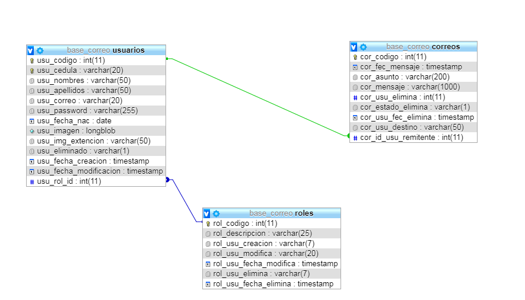

# Practica04-Mi-Correo-Electr-nico
<strong>•DIAGRAMA E-R</strong> 
 
Nombre de la base: base_correo 
CREATE TABLE USUARIOS ( 
    usu_codigo int(11) NOT NULL AUTO_INCREMENT, 
    usu_cedula varchar(20) NOT NULL, 
    usu_nombres varchar(50) NOT NULL, 
    usu_apellidos varchar(50) NOT NULL, 
    usu_correo varchar(20) NOT NULL, 
    usu_password varchar(255) NOT NULL, 
    usu_fecha_nac date NOT NULL, 
    usu_imagen longblob DEFAULT NULL, 
    usu_img_extencion varchar(50) DEFAULT 'NULL', 
    usu_eliminado varchar(1) NOT NULL DEFAULT 'N', 
    usu_fecha_creacion timestamp NOT NULL DEFAULT CURRENT_TIMESTAMP, 
    usu_fecha_modificacion timestamp NULL DEFAULT NULL, 
    usu_rol_id int NOT NULL, 
    PRIMARY KEY (usu_codigo), 
    UNIQUE KEY usu_cedula (usu_cedula), 
    FOREIGN KEY (usu_rol_id) REFERENCES roles(rol_codigo) 
    ) ENGINE=INNODB DEFAULT CHARSET=utf8 AUTO_INCREMENT=1; 

CREATE TABLE ROLES( 
    rol_codigo int PRIMARY KEY NOT NULL AUTO_INCREMENT, 
    rol_descripcion varchar(25) NOT NULL, 
    rol_usu_creacion varchar(7) NOT NULL, 
    rol_usu_modifica varchar(20), 
    rol_usu_fecha_modifica timestamp DEFAULT CURRENT_TIMESTAMP, 
    rol_usu_elimina varchar(7), 
    rol_usu_fecha_elimina timestamp DEFAULT CURRENT_TIMESTAMP 
    ) ENGINE=INNODB DEFAULT charset=utf8 AUTO_INCREMENT=1; 

CREATE TABLE CORREOS( 
    cor_codigo int PRIMARY KEY NOT NULL AUTO_INCREMENT, 
    cor_fec_mensaje timestamp DEFAULT CURRENT_TIMESTAMP NOT NULL, 
    cor_asunto varchar(200) NOT NULL, 
    cor_mensaje varchar(1000) NOT NULL, 
    cor_usu_elimina int, 
    cor_estado_elimina varchar(1) DEFAULT 'N', 
    cor_usu_fec_elimina timestamp DEFAULT CURRENT_TIMESTAMP, 
    cor_usu_destino varchar(50) NOT NULL, 
    cor_id_usu_remitente int NOT NULL, 
    FOREIGN KEY (cor_id_usu_remitente) REFERENCES usuarios(usu_codigo) 
    ); 

INSERT INTO ROLES VALUES (1,'Admin','Administrador','N','S','N','S'); 

INSERT INTO ROLES VALUES (2,'Usuario','Usuario','N','S','N','S'); 
 
 
<strong>•PROGRAMA FUNCIONANDO</strong> 
 
 
 
 
 
